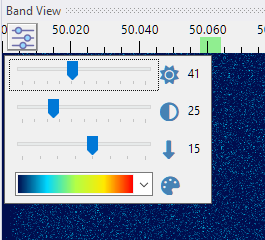
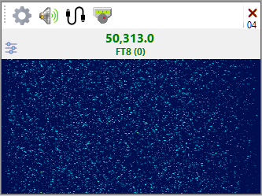
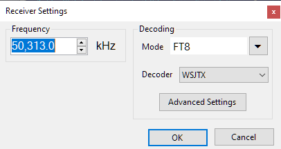
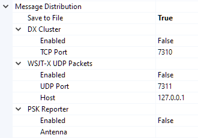

## Installation

- Click on the Download button above and download the _JTSkimmer.zip_ file.

- Run _JTSkimmerSetup.exe_ from the zip and follow the instructions.

- The setup includes the latest version of
  [OmniRig](https://www.dxatlas.com/omnirig/). 
  If you already have OmniRig installed and it works fine, click Cancel at this prompt:
  
  
  
- Replace the original _jt9.exe_  file in the WSJT-X installation folder with the 
  custom-built _jt9.exe_ included in  the JT Skimmer setup. This custom build has extra code 
  that allows decoding of the MSK144 mode. The code 
  [will be included](https://sourceforge.net/p/wsjt/mailman/message/58721482/)
  in the next official build of WSJT-X,
  but until this happens, please use the custom build, or MSK144 will not be decoded.
  
## Configuration
- Connect your SDR receiver to the computer.

- Start the program. Click on _Tools / SDR Devices_ in the menu. This dialog will open:

  

- Click on a radio button to select the SDR that you want to use.

- Select the desired bandwidth and center frequency. The settings in the screenshot
cover the first 360 kHz of the 10 m band. Click on OK.

- If all is good, the waterfall in the Band View panel will start. Click on this button
   
  and ajust the waterfall brightness and contrast:

  

- Click on the **Add Receiver** button on the toolbar and add one or more receivers.

  

- On the receiver panel:
  - click on the Speaker button  
    to listen to the receiver
  - click on the VAC button  
    to send the audio to the Virtual Audio Cable
  - click on the OmniRig button  to 
    tune your transceiver to the frequency of the receiver
 
- Click on the Settings button  
  to open the Receiver Settings dialog:

  

- Enter the receiver frequency, select the mode to decode or _No Decoding_. Click on OK.
  JT Skimmer will start decoding the selected mode on the selected frequency.

- Click on _Tools / Settings_ in the menu to open the Settings dialog. 

  

- In the Message Distribution section specify what
  the program will do with the decoded messages:
  - Save to a file
  - Serve as DX spots from the built-in Telnet cluster
  - Send UDP packets in the WSJT-X format to notify other programs, e.g. 
  [JT Alert](https://hamapps.com/)
  - Send to the [PSK Reporter](https://www.pskreporter.info/) web site  
 
- If desired, enable the _I/Q Output_ option. This will send out UDP packets with I/Q data 
  in the TIMF2 format understood by 
  [LinRad](https://www.sm5bsz.com/linuxdsp/linrad.htm), 
  [QMAP](https://wsjt.sourceforge.io/wsjtx.html) and 
  [MAP65](https://wsjt.sourceforge.io/map65.html) programs.

- Minimize the JT Skimmer window. It will disappear from the Task Bar and hide in the System Tray:

  
